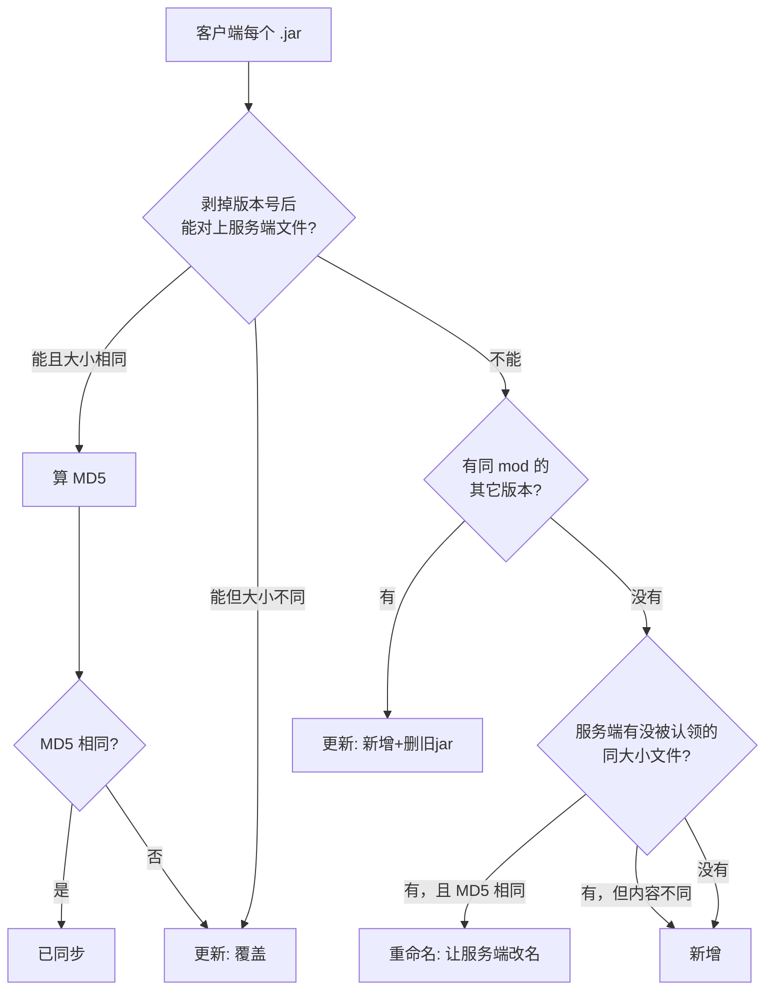

# ModSync —— Minecraft 整合包 客户端 / 服务端 mod 同步工具

在 PCL2 里更新完整合包后，自动找出客户端 mods 里哪些 mod 是新增或更新过的，
勾选后一键同步到服务端，覆盖旧版本并清理残留的旧 jar。

**零依赖**：不用装 Python / Node / .NET SDK，也不用改系统执行策略。

---


## 一、第一次打开要做什么

1. 填两个路径：
   - **客户端 mods**：例如 `%USERPROFILE%\Downloads\.minecraft\versions\你的整合包\mods`
     （PCL2 的整合包通常在 `.minecraft\versions\<版本名>\mods`）
   - **服务端 mods**：例如 `D:\MC服务器\mods`
     - 同一台电脑：直接填本地路径，或点「浏览...」选。
     - 另一台电脑：先在资源管理器里把服务端文件夹共享出来，
       然后这里填 `\\192.168.1.100\mcserver\mods` 这样的 UNC 路径。
2. 配置**自动保存**在 `%LOCALAPPDATA%\McModSync\config.json`，下次打开带着路径直接启动并自动扫描。
3. 勾选要同步的项目 → 点「同步到服务端」→ 核对弹出的变更明细 → 确认。

### 快捷键与操作

| 操作 | 说明 |
| --- | --- |
| `F5` | 重新扫描比对 |
| 「只选变更项」 | 一键勾选所有"新增 + 更新"，排除已同步的 |
| 双击表格某行 | 查看该文件完整详情（含将被删除的旧版本完整路径） |
| **在表格某行上点右键** | **打开菜单：定位到文件位置、重命名、复制 ▸、打开在线页面 ▸**（见「四」「五」） |
| `Ctrl+1` / `Ctrl+2` / `Ctrl+3` | 对**当前选中行**直接打开 MC百科 / CurseForge / Modrinth 的 mod 页面 |
| 「在线页面」按钮 | 点选一行后点它，菜单会弹在**按钮正右方**（鼠标往右一挪就能点），选站点即可 |
| 「实时监控客户端文件夹」 | PCL2 更新完 mod，约 2~3 秒后自动重新扫描，不用手动按 F5 |
| 「遗忘选中项」 | 把勾选的 mod 加入遗忘列表，之后不再出现在结果里 |
| 「遗忘管理」 | 查看/恢复已遗忘的 mod |
| 「重命名选中项」 | 勾 **1 个** = 改成任意新名字；勾 **多个** = 统一加前缀（如 `[客户端]`、`[服务端]`）。都在客户端 + 服务端同时改，内容不动 |

---

## 二、遗忘功能（不想再看到某些 mod 的差异）

有些 mod 的差异是**你永远不打算同步的**（典型如客户端专用的 `sodium`、`iris`、`fancymenu`）。
每次扫描都列出来碍事，可以用遗忘功能永久隐藏：

1. 在列表里**勾选**那些 mod；
2. 点工具栏 **「遗忘选中项」**，确认后它们就从列表消失；
3. 想找回来：点 **「遗忘管理」**，勾选后「恢复选中」，或直接「恢复全部」。

**关键设计**：遗忘是按 **mod 身份**记录的，不是按文件名。
所以 `example-1.0.jar` 被遗忘后，将来它升级成 `example-2.0.jar` 也**依然是遗忘状态**，
不会换个版本号就又冒出来。

遗忘列表存在配置文件里（`%LOCALAPPDATA%\McModSync\config.json` 的 `IgnoredMods`），
关掉程序再开依然有效。状态栏会提示当前隐藏了多少项，例如：

```
客户端 348 个 jar：新增 24，更新 1，已同步 323（已遗忘隐藏 3 项）
```

> 遗忘只影响**列表显示**，不会删除或改动任何文件。

---

## 三、重命名：给 mod 改完名，双端自动一致

场景：你在客户端把某个 mod 改成了自己习惯的名字（或者 PCL2 更新时换了一套命名风格），
服务端那个文件还叫旧名字。以前这种情况会被当成"新增"，同步过去之后服务端就会同时存在
新旧两个 jar —— 同一个 mod 两份，Forge/Fabric 加载时很容易直接报错崩服。

现在工具会把它认出来：**内容完全相同、只有文件名不同 = 重命名**。

- 扫描时自动判定，列表里显示为 **≡ 重命名**，操作说明写着 `旧名 → 新名`；
- 方框 **「识别重命名并自动同步」默认已勾选**：判定出来之后**直接**把服务端那个文件改名，
  不需要你再点一次确认。它只动文件名 —— 不复制、不覆盖、不删内容；
- 状态栏会写明结果：`已自动重命名 1 项（双端文件名已一致）`，日志里也留了逐条 `旧名 -> 新名`；
- 把那个勾去掉，它就既不识别重命名、也不改名，完全回到旧行为（当成"新增"处理）。

**在工具里主动改名（单个）**：勾选那一个 mod，点工具栏 **「重命名选中项」**，
输入新名字 → 确认。它会把**客户端和服务端一起改名**，改完自动重扫。
如果你先在服务端改了名，用这个功能也能把两边重新统一。

**在工具里主动改名（批量加前缀）**：勾选**多个** mod（≥2 个）再点同一个按钮，
会弹出「批量重命名」对话框 —— 填一个前缀，规则就是 **新文件名 = 前缀 + 原文件名**：

```
前缀填 [客户端]  →   A.jar 变成 [客户端]A.jar，B.jar 变成 [客户端]B.jar，……
前缀填 [服务端]  →   A.jar 变成 [服务端]A.jar，B.jar 变成 [服务端]B.jar，……
```

对话框里有 `[客户端]` / `[服务端]` 两个预设按钮、前 3 个改名结果的**实时预览**，
以及一个「服务端同名（或内容一致）的文件一起改名」开关（默认开；只想把客户端标记一下时把它勾掉）。
确认前会列出**每一个** `旧名 -> 新名`（客户端和服务端分开展示），跳过的项会写明原因
（例如"客户端已存在同名文件"）。执行完自动重扫。

> 前缀里不要带 `\ / : * ? " < > |` 这些字符，工具会直接拦下并提示。

**判定代价很小**：只有「客户端判为新增」×「服务端没被认领」的文件才进入候选，
并且先用**文件大小**筛一遍，只有大小相同的才去读内容算 MD5 —— 通常一次扫描只会多读个位数个文件。
（这一步与「启用 MD5 精确校验」开关无关，它只对少量候选读文件。）

> 注意：如果某次是**改名 + 改内容**同时发生，MD5 对不上，工具没法把它认成重命名，
> 只会按"新增"处理，服务端旧名文件会留成"仅服务端有"（工具不动它）。
> 这种情况请用「重命名选中项」手动统一，或手动删掉服务端那个旧文件。

---

## 四、右键菜单：一键定位到 mod 文件

在表格任意一行上**点右键**，会先选中该行，再弹出菜单：

| 菜单项 | 作用 |
| --- | --- |
| 打开客户端文件位置（定位到该 jar） | 打开资源管理器并**选中那个 jar 本身**（不是只开一层文件夹），可以直接改名、删除、查看 |
| 打开服务端文件位置（定位到该 jar） | 同上，定位到服务端对应的那个文件；服务端没有对应文件时这一项会变灰 |
| 打开服务端 mods 文件夹 | 直接打开服务端 mods 目录，处理"仅服务端有"的残留文件时方便 |
| 重命名这个 mod…（客户端 + 服务端一起改名） | 和工具栏「重命名选中项」同一个功能，不用先去勾选 |
| 批量重命名勾选的 N 个 mod…（统一加前缀） | 勾了 ≥2 个时可用；和工具栏按钮的多选行为一样，见「三」 |
| 查看文件详情 | 和双击某行一样 |
| **打开在线页面 ▸** | 二级菜单：**MC 百科 / CurseForge / Modrinth** —— 点一下浏览器直接打开这个 mod 的网页，见「五」 |
| **复制 ▸** | 二级菜单：**文件名 / 客户端完整路径 / 服务端完整路径**（服务端没有对应文件时该项变灰） |
| 遗忘这个 mod（以后不再出现在结果里） | 不用先勾选，直接忘掉右键的这一个 |

几点说明：

- 「定位」用的是 Windows 自己的 `/select`，所以是**精确选中那个文件**，不是只打开目录；
  整合包路径里带空格也照样正确（工具内部不走命令行拼接，不会被引号坑到）。
- 某一行标着 **▲ 更新** 时，「打开服务端文件位置」指的正是**即将被覆盖的那个旧文件**；
  标着 **≡ 重命名** 时指的是**即将被改名的那个旧名字文件** —— 核对/备份都方便。
- 文件在服务端**已经不在了**（被移动或删除）时，不会静默失败：
  会退一步打开它所在的文件夹，并在状态栏说明原因。

---

## 五、右键转到 MC百科 / CurseForge / Modrinth

在表格某一行上点右键 → **打开在线页面 ▸** → 选一个站点，**浏览器会自动打开这个 mod 在该网站的页面**。

**三种打开方式**（都只作用于"那一个 mod"，选一种顺手的用）：

| 方式 | 怎么操作 |
| --- | --- |
| 右键菜单 | 在**任意一行**上点右键 →「打开在线页面 ▸」→ 选站点（最直接） |
| 工具栏按钮 | 先用左键点选一行 → 点工具栏 **「在线页面」** → 菜单会弹在按钮**正右方**，选站点即可 |
| 快捷键 | 点选一行后按 **Ctrl+1** = MC百科、**Ctrl+2** = CurseForge、**Ctrl+3** = Modrinth |

| 站点 | 怎么定位到这个 mod 的 | 实测命中率（你的整合包） |
| --- | --- | --- |
| **CurseForge** | ① mod 自带的官网链接 → 直接用；② 填了 API Key 时用**文件指纹**向官方 API 反查（最准）；③ 没 Key 时用 cfwidget 校验猜出的网址 | **有 Key：8/8 精确**；无 Key：约 9/12 |
| **Modrinth** | 官方免费 API：先按文件 SHA1 精确查（从 Modrinth 下载的 jar 必中），再按名字搜索并核对标题 | 约 9/12 精确 |
| **MC 百科** | 抓搜索页、解析出 mod 编号（`/class/<编号>.html`） | 约 9/12 精确 |

几点说明：

- **查不到精确页面也不会失败**：自动退成打开该站的搜索结果页，状态栏会写明「未找到精确页面」。
- **只在点的时候才联网**，一次点击约 1 秒左右；解析成功的精确链接会记到
  `%LOCALAPPDATA%\McModSync\linkcache.json`，**同一个 mod 再点是瞬间打开**，断网也能用缓存。
- 读 jar 元数据是**只读打开 ZIP、取出里面那一个小文本文件**（`mods.toml` / `fabric.mod.json`），
  **不解压、不落盘、不会改动你的 mod 文件**；实测 348 个 jar 全部读一遍约 2.6 秒，而实际只在点击那一个 mod 时读那一个（约 7 毫秒）。
- 你的整合包路径带空格、文件名带 `[ ]`，都不影响这个功能。

### 可选：填 CurseForge API Key（想 100% 精确就填）

1. 打开 https://console.curseforge.com/ ，用 CurseForge / Overwolf 账号登录；
2. 建一个应用（填名称、用途、联系邮箱），在 **API Keys** 里生成一个 Key（免费）；
3. 粘贴到主界面右上角的 **「CurseForge Key：」** 输入框（密码框显示，不会明文摆在界面上）。

- Key 只写进你本机 `%LOCALAPPDATA%\McModSync\config.json`，**不会进项目目录、不写日志**；
- 不填也能用，只是 CurseForge 那一项会退回"猜网址 + cfwidget 校验"（约 9/12 精确）；
- 顺便记一笔：CurseForge 的 `mods/search` 接口对个人 Key 是拒绝的（返回 403），
  但我们走的是**文件指纹接口**，不受这个限制影响。

---

## 六、多套配置：配置档（Profile）

如果你有**多个整合包 / 多个服务端**，不用每次手工改两个路径——
把它们存成「配置档」，用主界面顶部的下拉框一键切换。

```
┌─ 配置档与文件夹（自动保存） ──────────────────────────┐
│ 配置档： [ Beebeeblock - The Skyhive  ▼] [新增][重命名][删除] │
│ 客户端 mods： [ E:\MC\...\Beebeeblock...\mods      ] [浏览...] │
│ 服务端 mods： [ D:\下载\[v3.06_server]...\mods      ] [浏览...] │
│ ☑ MD5 精确校验   ☑ 实时监控   ☐ 覆盖前备份                    │
└───────────────────────────────────────────────────────┘
```

- **切换**：下拉框选另一个档，路径立刻换过去并**自动重新扫描**。
- **新增**：点「新增」，起个名字（默认「整合包 N」），然后给它选两个文件夹。
- **重命名**：改名不影响已保存的路径。
- **删除**：只删配置记录，**不会动磁盘上任何 mod 文件**。

### 每个配置档的遗忘列表是独立的

这一点是刻意设计的：你在「天空蜂巢」里遗忘的那些客户端专用 mod，
不会影响你另一个整合包的扫描结果。各自遗忘、互不干扰。

### 旧配置会自动迁移

升级到本版后第一次启动，你原来那套路径会自动变成一个配置档，
档名从路径里推导（例如 `Beebeeblock - The Skyhive`），
**原有的遗忘记录一并迁移**。日志里会有记录：

```
[03:38:51] 已把旧配置迁移为配置档「Beebeeblock - The Skyhive」（含 29 个遗忘项）
```

---

## 七、直接同步到简幻欢等远程服务器（SFTP）

如果你的服务端不在本机，而是在**简幻欢（Simpfun）**这类托管平台上，
不用再手动用 WinSCP 一个个传了 —— 工具可以直接把 mod 同步到服务器上。

### 怎么开

1. 主界面「**同步目标**」下拉框选 **SFTP 远程服务器**；
2. 点右边的「**SFTP 设置...**」，填上主机、端口、用户名、密码、远程 mods 目录；
3. 点「**测试连接**」—— 它会连上去并把探到的情况列出来（服务端版本、目录里有几个 jar、
   服务器有没有 `md5sum`），确认没问题再点「确定」；
4. 回到主界面按 **F5** 扫描，之后就跟本地同步一模一样：勾选 → 「同步到服务端」→ 核对明细 → 确认。

### SFTP 的信息从哪来

在简幻欢面板的服务器页面里找 **SFTP / 文件管理** 那一块，通常长这样：

```
主机：xxx.simpfun.cn        （或一串 IP）
端口：2022                  （面板给什么就填什么，不是 22 也别改）
用户名：你的面板账号
密码：你的面板密码
```

> **远程 mods 目录**就是面板文件管理器里那个 `mods` 文件夹的路径，常见是 `/mods`。
> 不确定就先留空点「测试连接」，它会把登录后的默认目录列出来，照着填进去就行。

### 和本地同步完全一样的地方

- 四级判定、勾选同步、同步前明细确认、逐行结果回填、失败不中断 —— 全都不变；
- **「复制失败就绝不删旧版本」这条安全约束对远程同样生效**；
- 重命名（单个改名 / 批量加前缀 / 自动识别重命名）在远程也一样能用，走的是 SFTP 的改名。

### 远程特有的两点

**① 内容比对走服务器上的 `md5sum`，不下载整个整合包。**
第 2 级和第 4 级判定需要目标端文件的 MD5。如果为了算哈希把 1.4 GB 的整合包拉下来，
那这个功能就没法用了。所以远程模式下改为在服务器上执行 `md5sum` 命令拿哈希 ——
「测试连接」会告诉你服务器支不支持。

> 服务器**不支持执行命令**（只开了 SFTP，或没装 `md5sum`）时会自动退化：
> 内容比对只靠文件大小，界面和日志里都会写明。这种情况下建议把
> 「启用 MD5 精确校验」保持勾选，至少同名同大小的文件仍会走一遍哈希比对。

**② 右键菜单里「打开服务端文件位置」会变灰。**
远程文件没法用资源管理器"定位"。要路径的话用「**复制 ▸ 服务端完整路径**」，
再到面板的文件管理器里粘贴。

### 安全说明

- SFTP 密码和 CurseForge Key 一样，**只存在你本机** `%LOCALAPPDATA%\McModSync\config.json`，
  不进项目目录、不进日志、界面上是密码框；
- 每个**配置档**各自记一套 SFTP 设置，所以「天空蜂巢」和别的整合包可以指向不同的服务器；
- 连接用的是标准 SFTP（SSH 加密），密码不会明文过网。

> **关于 exe 体积**：远程同步需要 SFTP 客户端库，而 Windows PowerShell 5.1 里没有内置的，
> 所以内嵌了 SSH.NET（MIT 许可）。exe 因此从 384 KB 变成 **798 KB** ——
> 依然是一个绿色文件、依然不用装任何东西。详见 [lib\README.md](lib/README.md)。

---

## 八、判定"哪些 mod 更新了"的依据

这是本工具的核心。采用**四级递进**判定，兼顾准确与速度：



**"同一个 mod"是怎么认出来的？** 从文件名里剥掉这些可变部分，剩下的当作 mod 的身份标识：

```
journeymap-forge-1.20.1-5.9.18.jar
└────┬───┘ └┬──┘ └─┬──┘ └─┬──┘
   mod 名   加载器  MC版本  mod版本
   → 身份标识 = "journeymap"
```

这样 `journeymap-...-5.9.18.jar` 和 `journeymap-forge-...-5.9.20.jar` 就能被认成同一个 mod 的新旧版本。

**第 4 级（重命名）**：前三级都落空、本该判成"新增"的文件，再和服务端那些没被认领的文件比一次 ——
先用大小筛，大小一样才读内容算 MD5；两边一模一样就说明**只是改了名**。
这一级只在勾了「识别重命名并自动同步」时生效，见「三」。

**为什么不全靠哈希？** 整合包量大时算哈希很慢（尤其服务端在网络共享上）。
现在的策略让绝大多数文件在"文件名 + 大小"这一步就判定完毕，一次内容读取都不做；
只有同名且同大小的文件才去算 MD5，用来区分"真的一致"和"大小碰巧相同但内容不同"。

**为什么不全靠文件名版本号？** mod 作者命名风格千奇百怪
（`AE2-15.2.1-forge-1.20.1.jar` 把 MC 版本放最后很常见），纯字符串解析必然出错，
而且它无法发现"文件名没变但内容被改过"的情况。

> 关掉「启用 MD5 精确校验」后，判定退化为纯"文件名 + 大小"比对，扫描更快，
> 但同大小不同内容的文件会被误判为"已同步"。

---

## 九、状态说明

| 状态 | 含义 | 默认勾选 |
| --- | --- | --- |
| ● 新增 | 服务端没有这个 mod | 是 |
| ▲ 更新 | 服务端有旧版本，需要覆盖或替换 | 是 |
| ✔ 已同步 | 两边完全一致 | 否 |
| ≡ 重命名 | 内容完全一致，只是文件名不同；同步 = 让服务端改名 | 是（默认还会自动执行） |

> **「仅服务端有」的文件不会进列表**（列表是按客户端逐个文件列出来的），
> 只会在底部状态栏里给一个数量：`服务端另有 N 个文件客户端不存在（不会被改动）`。
> 想知道具体是哪些、或者要清理它们，用表格右键菜单的
> **「打开服务端 mods 文件夹」** 直接打开目录自己看。

底部状态栏汇总：`客户端 N 个 jar：重命名 r，新增 x，更新 y，已同步 z；服务端另有 w 个文件客户端不存在（不会被改动）`
（没有重命名项时，这一节不会显示；自动改名过会有 `已自动重命名 N 项（双端文件名已一致）`）

---

## 十、同步行为与安全设计

点「同步到服务端」后，**先弹窗列出完整的变更明细**，确认后才动手：

- **【将新增 x 个】** —— 目标端原本不存在。
- **【将覆盖 x 个已存在的文件】** —— 列出新文件名 + 被覆盖的旧文件名。
- **【将从服务端删除 x 个旧版本文件】** —— 列出每个将被删除的旧 jar。
  > 这一步很重要：只复制新 jar 不删旧 jar，服务端会出现同一 mod 的两个版本，
  > Forge/Fabric 加载时直接报错或崩溃。所以同步某个 mod 时，它的旧版本会一并清理。
- **【将重命名 x 个】** —— 列出 `旧名 -> 新名`。只改文件名，内容在扫描阶段已用 MD5 校验一致。
  > 勾着「识别重命名并自动同步」时，这类项目通常在你看到列表之前就已经自动改完了，
  > 只有改名失败（服务端在运行、文件被占用、无写权限）才会以「≡ 重命名」留在列表里，
  > 这时关掉服务端点一次「同步到服务端」即可。
- **【跳过 x 个】** —— 已一致的、或扫描后源文件发生变化的项目。

确认对话框与「遗忘」用的是同一套组件：**默认只显示前 10 项**，超过则折叠，
点「展开查看全部 N 项」看完整清单（列表可滚动），**底部按钮位置恒定**。
即使一次同步几百个 mod，也一定点得到「确认同步」。

其他保护措施：

1. **删除有边界，而且必须等新版本先落地**：只删"本次勾选同步的那个 mod"的旧版本，绝不碰其它文件；
   并且只有当它的新版本**确实复制成功之后**才会去删。复制失败时（磁盘满、无写权限、共享断开），
   旧 jar 会被**保留**下来并在结果里单独列出——宁可让服务端暂时留着新旧两份让你自己处理，
   也绝不让这个 mod 在服务端彻底消失。
2. **同步前复核源文件**：扫描后客户端文件若被改动过（大小变化），该项跳过而不是盲抄。
3. **可选备份**：勾选「覆盖前备份服务端旧文件为 .bak」，重名时自动加时间戳。
4. **结果逐行反馈**：每行"同步结果"列回填 `成功` / `失败：原因`，结束时弹窗汇总。
5. **失败不中断**：个别文件失败（服务端运行中、jar 被占用、无写权限）不影响其余文件。

> ⚠️ **同步前先关掉服务端**。运行中的 JVM 锁着 mods 里的 jar，复制会失败；
> 而且运行中替换 mod 本来也要重启才生效。同步前建议对服务端 `mods` 做一次整体备份。

---

## 十一、常见问题

**Q：扫描很慢，几百个 mod 要十几秒？**
正常，主要耗时在读文件。可以：① 关掉「启用 MD5 精确校验」；
② 服务端在网络共享（`\\...`）上时速度受网络限制。进度条会显示当前进度。

**Q：我明明改了名，服务端却没跟着改？**
按顺序查三处：① 方框「识别重命名并自动同步」是不是被关掉了（关掉就完全不做重命名判定）；
② 日志里有没有 `自动重命名失败`（服务端在运行、jar 被占用、没有写权限时改不了名，
列表里会留着「≡ 重命名」，关掉服务端后点一次「同步到服务端」即可）；
③ 是不是改名时**顺便换了内容** —— 那样 MD5 对不上，工具无法认定是重命名（见「三」末尾）。

**Q：某个 mod 没被识别出新旧版本，显示成两个独立项？**
说明它的文件名规则比较特别，工具没把版本号剥干净。影响很小：会被当作"新增"复制过去，
只是不会自动删服务端的旧 jar——这种情况手动把服务端旧的那个删掉即可。

**Q：服务端路径填了 `\\其它电脑\共享\mods`，同步报错无权限？**
需要在对方电脑上给共享文件夹开放"更改"权限（只读复制不进去）。
建议用固定 IP 或主机名，避免 DHCP 换地址后路径失效。

**Q：能不能反向同步（服务端 → 客户端）？**
把两个路径框对调即可，工具本身不区分方向。

**Q：改了 `ModSync.ps1` 但 exe 没变化？**
exe 是**把脚本打包进去**的独立文件，改脚本后必须重新运行 `build-exe.ps1` 才会生效。
详见 `docs\打包exe.md`。

**Q：配置文件在哪？想重置？**
`%LOCALAPPDATA%\McModSync\config.json`，删掉它就恢复初始状态。
同目录下还有 `ModSync.log`（运行日志），点界面上的「打开日志」按钮可直接定位。

---

## 十二、故障排查

### 「点开就卡死」（已修复）

**症状**：打开程序后界面长时间无响应，像死机一样。

**原因**：计算 MD5 用的是 PowerShell 循环逐块调用 `TransformBlock`。
在两三百个 mod（约 700 MB）的整合包上，脚本引擎逐块搬运数据的代价极高——
实测 **120 秒都跑不完**，而同样的工作交给 C# 原生只需 2 秒，**差 60 倍以上**。
程序本身没死，是它自己太慢了。

**修复**：
1. MD5 改用内嵌的 C# 实现（`McSync.FastHash`），基于原生 `MD5.ComputeHash`；
2. 加哈希缓存，服务端文件不再被重复计算；
3. 加扫描**防重入**：扫描期间的文件监控事件不再触发嵌套扫描；
4. 文件监控改为**首次扫描完成后才挂载**，不在启动瞬间抢资源。

**实测效果**（你的真实整合包，348 / 325 个 mod）：

| 阶段 | 耗时 |
| --- | --- |
| 枚举文件 | 125 ms |
| 比对 + 哈希（646 次） | 4270 ms |
| **扫描总计** | **约 4.4 秒** |

修复前：>120 秒未完成（等同卡死）。界面在整个过程中保持响应。

> 扫描 4 秒属于正常范围，因为要读取两端约 1.4 GB 数据做内容比对。
> 想更快可以关掉「启用 MD5 精确校验」——但那样就无法发现
> "文件名和大小都没变、内容却被改过"的情况，不建议对整合包这么做。
> 扫描途中按 **Esc** 可以随时中断。

### 「PCL 一更新 mod，程序就自动退出」（已修复）

**症状**：打开工具后去 PCL 更新客户端整合包，工具窗口自动消失，日志里只有"启动"没有"退出"。

**原因**：WinForms 的默认行为是——**UI 线程上任何未处理异常都会直接结束进程**。
而工具的自动重扫、文件监控这些动作会在界面上触发事件处理，PCL 更新时
（mods 目录被大量改写甚至整体删除重建）正是最容易踩到异常的时刻。
异常一旦逃逸，进程就被静默终结，连退出日志都来不及写。

**修复**（四层防护，任何一层都能兜住）：

1. **UI 线程异常拦截**：接管 `Application.ThreadException`，异常改为弹窗提示 + 写日志，**程序继续运行**；
2. **定时器隔离**：自动重扫的整个 Tick 回调包在 try/catch 内，异常只记日志不中断；
3. **监控隔离**：文件监控的事件回调与错误回调各自独立捕获异常，`InternalBufferSize` 提到 64 KB 防事件洪水溢出；
4. **监控自愈**：mods 目录被 PCL 删除重建后，监视器会自动重新挂载。

**实测**：800 次文件事件洪水、mods 目录整体删除重建、两者交替 3 轮——
程序全程存活且界面保持响应。启动后持续运行 15 秒以上无退出。

### 图标没变化 / 显示成 PowerShell 的图标（已修复）

这里其实有**两个**独立问题：

1. **窗口和任务栏图标**：代码从未设置 `$form.Icon`，所以窗口标题栏一直是宿主
   `powershell.exe` 的图标。现在 exe 启动时会把自带图标导出给脚本，窗口/任务栏都用它。
2. **`icon.ico` 只有 256×256 一个尺寸**：Windows 在资源管理器里显示小图标时要缩放它，
   效果糊。现在已生成 **6 个尺寸**（256/128/64/48/32/16）。

**如果换了新 exe 图标还是旧的**，那是 Windows 图标缓存，执行下面命令清一次：

```powershell
ie4uinit.exe -show
```

或者更彻底（会重建缓存，耗时几秒，桌面会闪一下）：

```powershell
taskkill /f /im explorer.exe; del /a /q "%localappdata%\IconCache.db"; start explorer.exe
```

### 任务栏图标显示成 PowerShell 的图标（已修复）

这是连着踩了三个坑，逐一说清：

1. **窗口图标没设置** → 已设置 `$form.Icon`。
2. **图标尺寸只有 32×32** → 任务栏需要 32/48/256 多档，小图会发虚。
   现在构建时把**完整多尺寸 ICO**（6 档尺寸）作为嵌入资源打进 exe。
3. **资源名不匹配**（最隐蔽的一个）：构建脚本把资源命名为 `appicon.png`，
   而启动器查找的是 `appicon.ico`——两边不一致，代码静默走了兜底分支，
   结果一直是 32×32。现在两边统一为 `appicon.ico`。

另外还做了两件事：
- **给进程设置独立 AppUserModelID**（`McModSync.Tool`）。窗口跑在 `powershell.exe`
  子进程里，不声明身份的话任务栏会按宿主进程归属图标。
- **去掉了 `powershell -WindowStyle Hidden`**。这个参数会让任务栏把窗口图标回退成
  宿主 powershell.exe 的图标；控制台窗口本身已由 `CreateNoWindow` 隐藏，不需要它。

日志里可以确认实际取到的尺寸：

```
[03:14:05] 窗口图标已加载：取 ICO 中最大尺寸 256x256
```

> 如果换了新 exe 图标仍未变，先清一次图标缓存：`ie4uinit.exe -show`

### 选了太多 mod 时点不到「确定」（已修复）

**原因**：确认对话框原先用 `MessageBox.Show`，把所有文件名拼成一段文本。
**Windows 的 MessageBox 会随文本长度变大**——mod 一多，对话框撑得比屏幕还高，
按钮被顶出可视区域，怎么点都点不到。

**修复**：改为自绘对话框，**尺寸固定 660×620 不随内容变化**，且**默认折叠**：

```
┌─ 确认遗忘 ───────────────────────┐
│ 将遗忘以下 300 个 mod：           │
│ ┌─────────────────────────────┐ │
│ │  · mod-a.jar                │ │
│ │  · mod-b.jar                │ │  ← 默认只列 10 个
│ │  …… 另有 290 个未显示        │ │
│ └─────────────────────────────┘ │
│ [ 展开查看全部 300 个 ]          │  ← 点它展开完整清单
│ 遗忘后可用「遗忘管理」恢复。      │
│              [ 确定遗忘 ] [ 取消 ]│  ← 永远在此位置
└──────────────────────────────────┘
```

**默认只显示前 10 项**（10 项及以内全部显示，不出现展开按钮）；
超过 10 项时折叠，点「展开查看全部 N 个」看完整清单，再点「收起清单」折回。

列表区域是**可滚动的**：即使展开后有几百项，也能用鼠标滚轮或右侧滚动条看完，
不会超出对话框、更不会把底部按钮挤出去。无论多少项，**按钮位置恒定，一定点得到**。

### 「新版本没复制成功，旧 jar 却被删了」（已修复）

**症状**：同步时某个 jar 复制失败（磁盘满、没有写权限、网络共享断开），
服务端上那个 mod 的**旧版本也一起消失了** —— 结果这个 mod 在服务端彻底没了。

**原因**：同步的执行顺序是"先重命名 → 再复制 → 最后删旧版本"，
但删除那一步**只看旧文件在不在，没有回头看对应的新版本到底复制成功没有**。
复制失败 + 删除成功，就正好凑成"两头空"。

**修复**：删除前先查这次复制是否成功（`Test-CanDeleteOldVersion`），
没成功就**保留旧版本**并在日志里写 `KEEP`，同步结果弹窗和状态栏也会单独报出保留了几项：

```
⚠ 有 2 个旧版本被保留：对应的新版本没有复制成功。
（直接删旧版本会让这些 mod 在服务端彻底消失，所以留着了。）
```

> 这是本工具唯一会**删除用户文件**的地方，所以这条约束被单独抽成纯函数并加了单元测试
> （`tests\Test-ModSync.ps1` 里的 `Test-CanDeleteOldVersion` 三条用例），改动时会被测试挡住。

### 「改完配置什么都没保存，界面却一声不吭」（已修复）

**症状**：换了整合包路径、改了配置档名、开关了选项，关掉重开发现全变回去了。

**原因**：`Write-Cfg` 的 `catch` 是空的 —— 写盘失败（磁盘满、目录被安全软件锁住、
`%LOCALAPPDATA%` 不可写）时既不写日志也不提示，用户只会觉得"这软件记不住设置"。

**修复**：写失败时写日志 + 置标志，由 1.5 秒的定时器在状态栏提示一次：

```
⚠ 配置保存失败，本次改动可能不会保留（详见日志）
```

同一机制也用于日志本身两路都写不进去的情况。

### 「路径失效时，日志写着"客户端 0 个 mod"」（已修复）

**症状**：整合包或服务端文件夹被移动/改名后打开工具，日志里是
`退出：配置档「X」客户端 0 个 mod，待同步变更 0 个`，看起来像"扫过了，没事可做"，
实际上**根本没扫描**（路径校验就没过），只是弹了个「路径有误」的框。

**原因**：扫描在路径校验失败时会提前 `return`，连"扫描开始"都不写日志；
而退出日志只报 `$script:Records.Count`，于是"没扫成"和"扫了但没变更"在日志里长得一模一样。

**修复**：新增"本次会话是否成功扫描过"的状态，退出日志改成两种写法：

```
退出：本次会话未成功扫描（路径无效，未执行扫描：「服务端 mods」路径不存在：...）| 客户端=... | 服务端=...
```

状态栏同步改为 `未扫描：路径有误`。

### 「make-icon.ps1 生成的是单尺寸图标」（已修复）

**症状**：换图标时跑了 `make-icon.ps1`，结果资源管理器里的小图标发虚、
任务栏图标也不清楚——正是「图标没变化 / 显示成 PowerShell 的图标」那节里修过的问题又回来了。

**原因**：脚本的说明写着"生成 256/128/64/48/32/16 六个尺寸"，但代码里 `$Sizes` 只被用来
`Select-Object -First 1` 取出 256，然后 `Icon.Save` 写出**一个单帧 ICO**。
（仓库里那个 6 帧的 `icon.ico` 显然不是这个脚本现在的版本生成的。）
实测：新脚本之前产出的是 `1 帧 / 256x256 / BMP 格式`。

**修复**：重写为逐档渲染 + 手写 ICO 目录，真正输出 6 帧 32bpp **PNG** 帧，
并在脚本末尾自己把写出的文件重新解析一遍做自检（帧数不对直接抛错）。
256 那一档必须是 PNG：`ModSync.ps1` 是自己解析 ICO 目录、把最大一帧的字节**当 PNG**
交给 `System.Drawing.Bitmap` 的（因为 `New-Object Icon($path)` 只能拿到 32×32），
那一档要是写成 BMP/DIB，窗口图标就直接加载失败了。

### 「成功的改名被报成失败」（已修复）

**症状**：偶尔弹出「自动重命名失败」，但去文件夹一看，文件其实**已经改好名了**。

**原因**：改名成功后的"遗忘项记账"（`Move-IgnoredIdentity`）写在同一个 `try` 里，
它一抛异常就被当成"改名失败"——文件明明已经改好了。批量改名同理，
会把这一项从"成功"挪到"失败"，自动改名还会因为 `$done` 没加而不触发重扫，列表停在脏状态。

**修复**：三处（自动改名 / 单条改名 / 批量改名）的记账都改成独立捕获，
出错只写日志（`遗忘项随改名迁移失败（不影响文件本身）`），不影响改名结果本身。

### 「改名路径上的 `Move-Item -Force`」（已修复）

**原因**：四处改名里有三处用的是 `[System.IO.File]::Move`（字面路径、目标存在就报错），
只有 `Invoke-Sync` 里的重命名用了 `Move-Item -Destination -Force`。
`-Force` 的语义是"目标存在就覆盖"，放在改名路径上等于把"绝不覆盖内容"这条底线交给了运气。

**修复**：统一成 `[System.IO.File]::Move`，四处一致。

### 日志在哪

出问题先看日志，两个位置都会写（互为备份）：

- `%LOCALAPPDATA%\McModSync\ModSync.log`
- `%TEMP%\McModSync.log`

界面工具栏的「打开日志」按钮可直接定位。日志会记录每次扫描的各阶段耗时、
哈希次数、异常堆栈，以及启动/退出状态。

### 「文件名或扩展名太长」（已修复）
**症状**：双击 `ModSync.exe` 弹出这个错误，界面打不开。

**原因**：Windows 创建进程时，命令行总长度上限是 **32767 字符**。
早期版本的 exe 用 `-EncodedCommand` 把整份脚本编码后塞进命令行传输，
而本脚本编码后长达 **104,852 字符**，是上限的 3 倍多，于是进程创建直接失败。
（这是打包方式的缺陷，与你的系统无关。）

**修复**：启动器改为先把脚本写到临时文件，再用 `-File` 执行。
命令行里只剩一个临时文件路径，长度固定，永远不可能超限。
`build-exe.ps1` 里也加了构建期自检，每次打包都会打印实际所需长度并警告。

**如果你手上还是旧版 exe**：重新运行一次 `build-exe.ps1` 即可；
或者临时用命令行启动脚本绕过：

```powershell
powershell -NoProfile -ExecutionPolicy Bypass -STA -File ".\ModSync.ps1"
```

### 界面打不开、闪一下就没了

1. 点「打开日志」看不到（界面都没起来）时，直接看文件：
   `%LOCALAPPDATA%\McModSync\ModSync.log`
2. 也可以从命令行启动脚本，错误会直接显示在控制台里：
   ```powershell
   powershell -NoProfile -ExecutionPolicy Bypass -STA -File "路径\ModSync.ps1"
   ```

### exe 运行后系统临时目录里残留 McModSync_*.ps1

正常情况下关窗时会自动删除。若用任务管理器强制结束了进程，文件会留下——
下次启动 exe 时，超过 1 小时的残留会被自动清理，不用手动管。

### 想知道 exe 是怎么启动脚本的

启动器把内置脚本解压成一个临时 `.ps1`，用
`powershell -NoProfile -ExecutionPolicy Bypass -STA -File <临时脚本>`
拉起。你在任务管理器里能看到这个子进程，GUI 实际由它承载。

> 命令行里**不要**加 `-WindowStyle Hidden`：实测它会让任务栏把窗口图标回退成宿主
> `powershell.exe` 的图标。控制台窗口本身已经由 `CreateNoWindow` 隐藏，不需要这个参数。

---

## 十三、自动化测试（改判定逻辑后必跑）

判定和改名这类"错了就会动你文件"的逻辑，现在有一份零依赖的单元测试：

```powershell
powershell -NoProfile -ExecutionPolicy Bypass -File "tests\Test-ModSync.ps1"
```

- **不装任何东西**：不用 Pester、不联网，靠 PowerShell 自带的 AST 解析器把纯函数抽出来单独跑，
  不会弹窗、不会碰你的整合包；
- 覆盖 `Get-ModIdentity`（mod 身份归组）、`Test-CanDeleteOldVersion`（复制失败不删旧版本）、
  `Build-RenamePlan` / `Invoke-RenamePlan`（改名计划与执行，在临时目录里真改文件）、
  `Test-NameMatch`（在线页面命中校验）等；
- 顺带会检查 `ModSync.ps1` **有没有 UTF-8 BOM** —— 丢了 BOM 时 Windows PowerShell 5.1
  会按 GBK 解码，报出来的是一堆莫名其妙的语法错误，这里会直接把真正的原因点破；
- 全通过退出码 `0`，有失败退出码 `1` 并列出每一条。

改完判定逻辑的完整流程：

```
1. 跑测试        powershell -File tests\Test-ModSync.ps1
2. 重新打包      powershell -File build-exe.ps1
3. 双击 exe 做一次真实比对与同步（判定逻辑改动要覆盖 README「八、判定依据」的四级）
```

> 界面流程（`Invoke-Scan` / `Invoke-Sync`）依赖 WinForms 控件，单元测试覆盖不到，
> 仍然靠第 3 步的真实运行验收。

---

## 十四、文件清单

| 文件 | 说明 |
| --- | --- |
| `ModSync.exe` | **日常使用就双击这个**。单文件绿色版，798 KB，已内嵌脚本、图标与 SFTP 库，可单独拷走 |
| `ModSync.ps1` | 主程序源码（含中文注释）。改逻辑改这里 |
| `build-exe.ps1` | 把 `ModSync.ps1` 重新打包成根目录的 `ModSync.exe` |
| `make-icon.ps1` | 把任意 PNG 转成多尺寸 `icon.ico`（生成 256/128/64/48/32/16 六个 PNG 帧，带自检） |
| `icon.ico` | 图标源文件，打包时会被自动嵌入 |
| `lib\Renci.SshNet.dll` | 内嵌的 SFTP 客户端库（SSH.NET，MIT）。远程同步要用，见 [lib\README.md](lib/README.md) |
| `tests\Test-ModSync.ps1` | 纯逻辑单元测试（零依赖，见「十三」） |
| `docs\打包exe.md` | 打包原理、重新构建步骤、换图标、可移植性检查 |
| `LICENSE` | MIT 许可证 |

程序运行时还会在本机 `%LOCALAPPDATA%\McModSync\` 下产生：
`config.json`（路径配置 + 遗忘列表 + 可选的 CurseForge Key）、`ModSync.log`（日志）、
`linkcache.json`（「打开在线页面」解析出来的精确链接缓存，可随时删除）。

---

## 十五、许可

本项目采用 **MIT License**，见 [LICENSE](LICENSE)。你可以自由使用、修改、再分发，
包括商用；只需要保留版权声明和许可证原文。

> **与 Mojang / Microsoft 无关。** 本工具只是一个本地文件同步器，
> 不包含、不修改、也不分发任何 Minecraft 游戏代码或资源；
> Minecraft 是 Mojang Studios / Microsoft 的商标。

