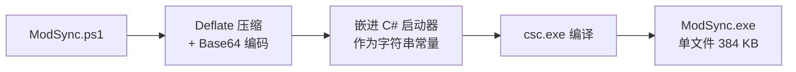

# 打包成 exe：原理与重新构建

## 一、为什么是 exe，以及它解决了什么

本工具最初遇到的限制是系统执行策略为 `Restricted`，双击 `.ps1` 会被系统拒绝执行：

```
无法加载文件 ModSync.ps1，因为在此系统上禁止运行脚本。
```

`.exe` 不受执行策略管辖，所以打包成 exe 之后双击就能用，同时还有几个附带好处：

- 只有一个文件，可以拷到桌面 / U 盘 / 别的电脑，不用带一堆依赖文件；
- 有独立图标，任务栏和资源管理器里一眼能认出；
- 不怕 `ModSync.ps1` 被误删或改动，exe 里有一份自包含的副本。

---

## 二、打包原理



运行时反过来走一遍：


产物**直接放在项目根目录**（`ModSync.exe`），不再套一层 `dist\`：
这就是个"双击根目录那个 exe 就能用"的绿色工具，多一层子目录只会让人找不到入口。

### 应急：不依赖 exe 直接运行

**首选（最省事）：直接用源码启动**，不需要 exe。在项目目录下：

```powershell
powershell -NoProfile -ExecutionPolicy Bypass -STA -File ".\ModSync.ps1"
```

也可以右键 `ModSync.ps1` → 「使用 PowerShell 运行」。

**可选：把脚本从 exe 里解出来**（只拿到 exe 时用）。
脚本的 GZip 副本以 Base64 存在 exe 中，常量名是 `PackedScriptGzipB64`。
注意必须按**字节**定位——这些字符串在 PE 里按 UTF-16 存储，
直接用 `ReadAllText(..., Unicode)` 整体读会因堆里其它字节而错位：

```powershell
$exe = '.\ModSync.exe'          # 换成你的实际路径
$bytes = [System.IO.File]::ReadAllBytes($exe)
$anchor = [System.Text.Encoding]::ASCII.GetBytes('PackedScriptGzipB64')
$found = -1
for ($i = 0; $i -le $bytes.Length - $anchor.Length; $i++) {
    $ok = $true
    for ($j = 0; $j -lt $anchor.Length; $j++) {
        if ($bytes[$i + $j] -ne $anchor[$j]) { $ok = $false; break }
    }
    if ($ok) { $found = $i; break }
}
if ($found -lt 0) { throw '未找到内嵌脚本，可能 exe 版本过旧，请重新运行 build-exe.ps1' }
$q = $found + $anchor.Length
while ($bytes[$q] -ne 0x22) { $q++ }          # 跳到起始引号
$start = $q + 1
$end = $start
while ($bytes[$end] -ne 0x22) { $end++ }      # 跳到结束引号
$b64 = [System.Text.Encoding]::ASCII.GetString($bytes, $start, $end - $start) -replace "`r|`n", ''
$in  = New-Object System.IO.MemoryStream([Convert]::FromBase64String($b64))
$gz  = New-Object System.IO.Compression.GZipStream($in, [System.IO.Compression.CompressionMode]::Decompress)
$out = New-Object System.IO.MemoryStream
$gz.CopyTo($out)
$tmp = Join-Path $env:TEMP 'ModSync-recovered.ps1'
[System.IO.File]::WriteAllText($tmp, [System.Text.Encoding]::UTF8.GetString($out.ToArray()),
    (New-Object System.Text.UTF8Encoding($true)))
powershell -NoProfile -ExecutionPolicy Bypass -STA -File $tmp
```

几个关键设计：

1. **脚本走临时文件，不走命令行。**
   这是踩过坑之后定下的：Windows 创建进程的命令行上限是 **32767 字符**，
   而本脚本用 `-EncodedCommand` 传输需要 **37 万字符**（Base64 + UTF-16LE），
   超限十倍以上，会直接报「文件名或扩展名太长」。
   现在启动器把脚本写入临时文件，命令行里只有一个临时文件路径，长度恒定。
   `build-exe.ps1` 每次构建都会自检并打印这个长度，防止回退。

2. **为什么不是 Base64 传脚本？**
   除了长度问题，`-EncodedCommand` 还要求把整份脚本转成 UTF-16 再 Base64，
   体积直接翻倍。写文件没有这个问题，也便于排查（临时文件是明文 `.ps1`）。

3. **先压缩再嵌入。**
   脚本 157 KB，Deflate 压缩后 Base64 约 55 KB，再加上图标资源，exe 总体积仍然很小。
   另外还嵌了一份 GZip 版（`PackedScriptGzipB64`），纯粹是为了应急时能手动解出来。

4. **`/target:winexe`。**
   编译成 Windows GUI 子系统程序，双击不会闪出一个黑色控制台窗口。
   启动器内部再用 `CreateNoWindow` 保证它拉起的 PowerShell 也不弹窗。

5. **零第三方依赖。**
   编译器用的是系统自带的 `C:\Windows\Microsoft.NET\Framework64\v4.0.30319\csc.exe`，
   不需要安装 .NET SDK、不需要 `ps2exe` 之类的模块、不需要联网。

---

## 三、改了脚本后怎么重新打包

改完 `ModSync.ps1`，在项目目录下运行：

```powershell
# 0) 改了判定/改名/同步逻辑的话，先跑一遍单元测试（零依赖，几秒钟）
powershell -NoProfile -ExecutionPolicy Bypass -File ".\tests\Test-ModSync.ps1"

# 1) 重新打包
powershell -NoProfile -ExecutionPolicy Bypass -File ".\build-exe.ps1"
```

输出（数字随脚本大小变化，以下是示意）：

```
[1/4] 读取源脚本：...\ModSync.ps1
      脚本 140858 字符
[2/4] 压缩并编码脚本内容
      160450 字节 -> 压缩后 Base64 56596 字符
      GZip 版（应急用）56620 字符
      自检：若改用 -EncodedCommand 需 375,624 字符，超 CreateProcess 上限 32767。
      本启动器采用「临时脚本文件 + -File」方式，命令行长度固定，不受此限制。
[3/4] 生成启动器 C# 源码
      嵌入完整图标：22718 字节（多尺寸）
[4/4] 编译
      使用图标：...\ModSync\icon.ico

构建成功
  产物：...\ModSync\ModSync.exe
  大小：393,728 字节 (384.5 KB)
```

- 因为有执行策略限制，必须带 `-ExecutionPolicy Bypass`（或把 `-File` 换成读取源码执行）。
- 如果从别的目录运行，用 `-ScriptDir "路径"` 显式指定工具所在目录；
  没给又推不出项目目录时会**直接报错**，不会去猜一个写死的路径。
- 构建的中间文件（生成的 C#、编译日志）写在本机统一的临时区
  `D:\cache\ModSync\build\`，成功后连 `build` 一起删掉；编译失败时会保留，方便排查。
  机器上没有 `D:\cache` 时自动退回系统 `%TEMP%\ModSync\`（保持可移植）。

---

## 四、换图标

`icon.ico` 就在工具目录里，`build-exe.ps1` 检测到它就会自动嵌入。

**用现成的 ICO**：直接把你的 `icon.ico` 覆盖过去，重新打包即可。

**用 PNG 转**：项目自带转换脚本，会把图片居中裁成正方形，并生成
**6 帧 PNG 格式**的多尺寸 ICO（256/128/64/48/32/16）：

```powershell
powershell -NoProfile -ExecutionPolicy Bypass -File ".\make-icon.ps1" -Png "D:\图片\myicon.png"
```

然后重新运行 `build-exe.ps1`。

> ⚠ 256×256 那一帧必须是 PNG 格式：`ModSync.ps1` 启动时是自己解析 ICO 目录、
> 取最大一帧的字节直接交给 `System.Drawing.Bitmap` 的（因为 `New-Object Icon($path)`
> 只能拿到 32×32）。那一帧要是写成 BMP/DIB，窗口图标就直接加载失败。
> `make-icon.ps1` 已经按这个约定生成，末尾还会自己把写出的文件重新解析一遍做自检。

**不想要图标**：删掉 `icon.ico` 再打包，exe 会用系统默认图标，功能不受影响。

> 想要更"专业"的图标，也可以去 iconfont、IconPark 之类的站点下载现成的 ICO，
> 尺寸建议包含 256×256，这样在高分屏下也清晰。

---

## 五、可移植性与注意事项

**目标机器需要什么？**

| 依赖 | 说明 |
| --- | --- |
| Windows 7 SP1 及以上 | 依赖 .NET Framework 4.x |
| .NET Framework 4.x | Win10/11 全部自带 |
| Windows PowerShell 5.1 | Win10/11 全部自带 |

也就是说：**任何一台正常的 Windows 10/11 电脑都能直接跑，不用装东西。**

**杀毒软件误报？**
启动器会往系统临时目录写一个 `.ps1` 再调用 `powershell.exe` 执行它，这是某些启发式引擎的敏感行为模式，
小概率会被拦。如果遇到：

1. 把 `ModSync.exe` 加入白名单；
2. 或者退一步，直接用 `ModSync.ps1`（右键 →「使用 PowerShell 运行」，或 `-ExecutionPolicy Bypass` 命令行启动）；
3. 想彻底避免这个行为，唯一办法是把整个工具用 C# 重写成原生 WinForms 程序——
   功能等价，但代码量大概是现在的两倍，且改起来没脚本方便。

**exe 里嵌的是明文吗？**
脚本只是压缩 + Base64，**不是加密**，用工具能提取出来。这没关系：里面没有任何密钥或隐私，
唯一的配置（两个文件夹路径）存在 `%LOCALAPPDATA%\McModSync\config.json`，不在 exe 里。

**exe 会在什么位置写文件？**

| 内容 | 位置 |
| --- | --- |
| 路径配置 | `%LOCALAPPDATA%\McModSync\config.json` |
| 运行日志 | `%LOCALAPPDATA%\McModSync\ModSync.log`（写不进去时回退 `%TEMP%\McModSync.log`） |
| 在线链接缓存 | `%LOCALAPPDATA%\McModSync\linkcache.json` |
| 临时脚本（运行时） | 系统临时目录，进程结束后自动删除 |

所以 exe 放在只读目录（比如只读网络盘）里也能正常工作。
